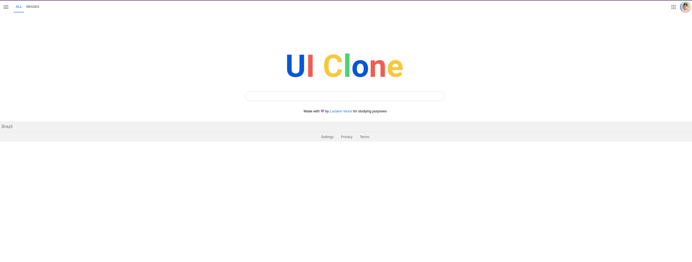
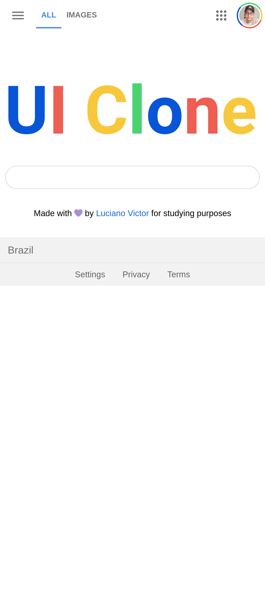

<h1 align="center">
Google Clone - Google (Homepage)
</h1>

  

  

## Resources

- [x] HTML, CSS, JS
- [x] SVG Images

## Start Dev Environment for VSCode

1. Open project folder in `VSCode`
2. Install `Live Server` extension
3. Right click `index.html` > `Open with Live Server`
4. Access the **generated address** in your browser 🚀
